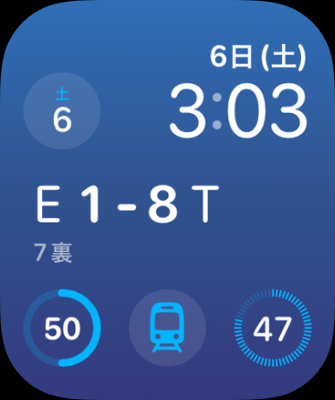

# FavField

An Apple Watch app that shows live NPB scores for your favorite team.



## Structure

- [`worker/`](worker/) — Cloudflare Workers API
- [`FavFieldWatch/`](FavFieldWatch/) — watchOS app
- [`FavFieldWidget/`](FavFieldWidget/) — WidgetKit complication
- [`Shared/`](Shared/) — API client and preferences shared by app + widget

## Requirements

- Xcode 26+
- [XcodeGen](https://github.com/yonaskolb/XcodeGen) (`brew install xcodegen`)
- Apple Developer Program account (for App Groups and device install)
- Cloudflare account (for Worker deploy)

## Worker (API)

Deploy the score API:

```bash
cd worker
npm install
npx wrangler login   # first time only
npm run deploy
```

Endpoints:

- Base URL: `https://fav-field.katsuma.workers.dev`
- [`/teams`](https://fav-field.katsuma.workers.dev/teams) — 12 NPB teams
- `/score?team=T` — latest one-line score (e.g. `T 1-0 G 7裏`)

Update API base URL via build settings or environment variables (see [Development modes](#development-modes) below).

Local dev:

```bash
cd worker && npm run dev
curl "http://localhost:8787/score?team=T"
```

## Development modes

API behavior is resolved in this order:

1. Xcode scheme environment variables (app process only)
2. `Info.plist` values baked in at build time (app + widget)
3. Production fallback URL

| Setting | Environment variable | Info.plist key | Debug default |
|---------|---------------------|----------------|---------------|
| Base URL | `FAVFIELD_API_BASE_URL` | `APIBaseURL` | `http://localhost:8787` |
| Use mock | `FAVFIELD_USE_MOCK` | `UseMockAPI` | `YES` |
| Mock state | `FAVFIELD_MOCK_STATE` | — | `live` |

### Mock responses (default Debug)

Debug builds use Swift-side mock data by default. No network required.

Run the app or widget preview to see score UI immediately. Change mock state in Xcode:

**Product → Scheme → Edit Scheme → Run → Arguments → Environment Variables**

| Variable | Example | Effect |
|----------|---------|--------|
| `FAVFIELD_MOCK_STATE` | `live` | Live score with inning |
| `FAVFIELD_MOCK_STATE` | `final` | Final score |
| `FAVFIELD_MOCK_STATE` | `pre` | Pre-game with start time |
| `FAVFIELD_MOCK_STATE` | `none` | No game today |

Note: scheme environment variables apply to the **watch app process only**. The widget extension reads `UseMockAPI` from `Info.plist` (Debug = mock on by default).

### Localhost Worker API

To hit a real local Worker instead of mock data:

1. Start the Worker: `cd worker && npm run dev`
2. In Xcode scheme, set `FAVFIELD_USE_MOCK=0`
3. Keep default `APIBaseURL` (`http://localhost:8787`) or set `FAVFIELD_API_BASE_URL=http://localhost:8787`

For a **physical device**, use your Mac's LAN IP instead of `localhost`:

`FAVFIELD_API_BASE_URL=http://192.168.x.x:8787`

### Production API

Release builds point to production automatically. For Debug against production:

`FAVFIELD_USE_MOCK=0`
`FAVFIELD_API_BASE_URL=https://fav-field.katsuma.workers.dev`

## Build (watchOS)

```bash
make build
```

This runs `xcodegen generate` and builds for the watchOS simulator SDK.

Open in Xcode:

```bash
xcodegen generate
open FavField.xcodeproj
```

## Xcode setup

### Signing

1. Select target **FavFieldWatch** → **Signing & Capabilities**
2. Set **Team** to your Developer Program team
3. Enable **App Groups** → check `group.tv.katsuma.FavField`
4. Repeat for **FavFieldWidget**

Register on [Apple Developer Portal](https://developer.apple.com/account/resources/identifiers/list) if needed:

- App Group: `group.tv.katsuma.FavField`
- App IDs: `tv.katsuma.FavField.watchkitapp`, `tv.katsuma.FavField.watchkitapp.widget` (with App Groups enabled)

### Info.plist

The watch app requires `WKApplication` and `WKWatchOnly` in `FavFieldWatch/Resources/Info.plist` (already configured via `project.yml`).

## Simulator

1. Scheme: **FavFieldWatch**
2. Destination: an **Apple Watch** simulator (paired with an iPhone simulator)
3. **Product → Run** (⌘R)
4. Pick a favorite team in the app

### Add complication (simulator)

1. On the Watch simulator, long-press the watch face → **Edit**
2. Tap a complication slot → choose **FavField Score**
3. Confirm the one-line score appears (e.g. `E - T 18:00`)

Changing the team in the app reloads the widget timeline automatically.

## Device install

1. Pair your Apple Watch with your iPhone
2. Connect the iPhone to your Mac
3. In Xcode, select your **Apple Watch** as the run destination
4. **Product → Run** (⌘R)

If install fails, check **Signing & Capabilities** on both targets and that App Groups match on the Developer Portal.

### Add complication (device)

1. Long-press the watch face → **Edit**
2. Add **FavField Score** to an inline or rectangular slot

## Usage

1. Open FavField on Apple Watch and pick your favorite team (one of 12 NPB teams).
2. The main screen shows the latest score line from the Worker API.
3. Tap **Refresh** to fetch the latest score.
4. Add the **FavField Score** complication for always-visible score on your watch face.

## Notes

- App Group `group.tv.katsuma.FavField` shares the selected team between the app and widget.
- Complication refresh uses status-based intervals: ~3 min (live), ~15 min (scheduled), ~30 min (final). watchOS may delay updates further due to system budget limits.
- Scores are scraped from [Yahoo! Sports NPB](https://baseball.yahoo.co.jp/npb/); HTML changes may require Worker updates only.
